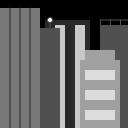

_A few quick notes_:  
 While it won't be listed in requirements, checking for errors was a part of every assignment.  
 Links to the zip files will be a part of the header (so below, Assignment 1 leads to the download link for the zip file)

## [Assignment 1](Lent.zip)
 ### Requirements:  
* Create a composition using shapes that could be interpreted to be either an 'outerspace' or 'cityscape' scene.  
* Create a canvas that is 128 pixels wide by 128 high (at a minimum).  
* Create a gray background for the canvas with a grayscale color value.  
* For all shapes in your composition, use only grayscale values for the stroke and fill colors.  
* For shapes in your composition, create shapes from the four primitive types listed below, for example, create a point and a rectangle:
  * _Point_
  * _Line_
  * _Ellipse_
  * _Rectangle_  
* Create, at a minimum, one primitive shape with either no stroke or no fill.  
* Change the style of the stroke on one shape, at a minimum, to round, bevel, or join.
  * _Use strokeJoin() or strokeCap()_
 
 
 This was our first assignment we had done for the class, and it was fairly simple.  
 For this, I had decided to go with a city skyline, the result being a view of some skyscrapers in the night.
 Now I have knowledge prior to this class (Mostly due to having to retake it thanks to a bad semester for me), so I know I could've added color to it, but I decided to keep it simple and stick to the required grayscale colors.  
 To keep everything from blending together, I tried to use various different shades of gray for each building (This also helped give a sense of depth to the image), and all of the lights were pure white to help them stand out.  
 I primarily ended up using the line & rectangle tool to make most of the image, but I made sure to add a point or ellipse in part of the image. The line tool was mostly for the smaller details on the roofs of the buildings.  
 The only issue I had came across was the fact that I forgot to incorporate the last point of the requirements. I must've skimmed the assignment and missed that point.  
 And here's what the code in the zip file produces (The final product)!
 
 
 

## [Assignment 5](Lent%205.zip)
 ### Requirements:  
* Design a composition that is within the theme of either Television or a Desktop Computer.  
* Create a canvas that is 400 pixels wide by 400 high (at a minimum).  
* Add a minimum of two buttons, one, a rectangle shape, and the other, a ellipse. Each button should use either the mouseClicked() or mousePressed() functions to measure user input. Creating buttons requires testing the position of the mouse compared to the boundary of the button shape. This is shown in the examples utilizing mouseX and mouseY information covered in Assignment Three.
  * _ellipseMode()_
  * _mouseClicked()_
  * _mousePressed()_
  * _mouseX_
  * _mouseY_  
* Add another button, rectangle or ellipse, that uses the keyPressed() function and is triggered by a specific key on the keyboard. This means the mouse should be within in the boundaries of the button shape AND the chosen key should be pressed (not the mouse) to activate the button.
  * _keyIsPressed()_  
* Include if (conditional) statements (use one of the following, twice in your sketch, at a minimum, in your sketch):
  * _if_
  * _if/else_  
* Incorporate the following design principles in your assignment:
  * _Color, choose a color scheme, work with a palette of colors (maximum of five)._  
   **_The Adobe Color site is a good tool for selecting a group of colors using different systems from color theory._**  
  * _Alignment, Proximity, Similarity of elements in your composition._  
   **_Use these three principles to group elements together in the visual space._**  
  * _Scale and Proportion._  
   **_Use this design principle to indicate a visual hierarchy. (what is emphasised)._**
 
 
 Compared to the previous Assignment above, this one had required much more work and thought into making it right.  
 For this assignment, I decided to make a small, boxy, gray TV set and have the buttons effect the screen.
 As noted in the 3rd point in the requirements, the past few assignments had covered:
  * Colors and ways to implement them (Assigment 2)
  * Creation of general variables, including variables to locate the mouse's position and math variables (Assignment 3)
  * Use of mouse & keyboard buttons & movement of objects on the canvas (Assignment 4)
 
 All of these would end up being used in some shape or form in this assignment.  
 Like when incorporating color into the design, I had taken a palette of colors from the Adobe Color site and once I had found out what the RGB color codes were, I implemented them into the separate "channels" that each button would bring you to.  
 Getting the buttons to work properly was also solved by using a formula from previous assignments that would detect when the mouse was hovering over a certain button.  
 Though creating our own functions would come up in later assignments, things like detecting when the mouse or a key was pressed required their own functions, and I learned how to create some of my own to make everything work.  
 I primarily used if/else statements to discern what should be on the screen at any given moment. Neither of the channel buttons would produce anything until the TV was turned on (meaning both channels would be false until power was true) and when switching back and forth between channels, I'd set one to false and the other to true to hide anything from the other channel.  
 Easily the most difficult part of this was getting the channels to properly display what was needed. For a long time, when I pressed a button it would do nothing. It was a fairly simple solution which required a bit of work on the channel functions, but I had been tired when working on it and couldn't focus on the easy fixes at the time.
 

## [Assignment 7](Lent%207.zip)
 ### Requirements:  
* Design a composition that is within the theme of either Halloween, Retro Games, or Nature.  
* Create a canvas that is 400 pixels wide by 400 high (at a minimum).  
* Create and assign values to an array.  
* Use the print function to determine the length of an array you created and assigned values to.  
* Create an array, then assign values to the array using a for loop.  
* Create motion using values from an array. Using a for loop, draw shapes that include the array value as one of the position values for the shape, creating motion.  
* Set a value in the array to the a current mouse position value.

 This was definitely a _different_ assignment from the rest I'd worked on previously.  
 For this, I focused on nature. Specifically a rainy sky with clouds floating by and a rainbow in the background.  
 Aside from the introduction to arrays (which function a lot like a package of variables), I also had been working on different ways of creating my variables and code.  
 I had been getting help from a friend for this one. They would give me simple examples and such to follow, but the way they made things was different than what I (and seemingly the rest of the class) had been doing.  
 I however just followed these examples to the dot because I had feared I'd mess up the code if I tried to convert it to what we typically use in this class.  
 Despite this, I still did my best to try and do things as I had in previous assignments.  
 Starting off, I used a for loop in the setup to create exactly 8 clouds on the canvas. when one went off screen, another one would spawn in to bring the number back up to 8.  
 These cloud structures came from a function near the bottom, which not only created the cloud shape, but also made the clouds move left to right, as well as randomly bob up & down.  
 For the raindrops, I had to figure out how to create a class in p5.js. Doing so made some of the later steps take up less lines of code & made it easier to program.  
 The class determined a random point anywhere on the canvas in which the raindrop could spawn, made it move straight down, and deleted it once it got off the canvas.  
 Later on, I used this same class in a draw function which would create a random amount of raindrops (from 0 to 5) anywhere on the canvas every time the function was called.  
 Since this function is being called constantly, it spawns in raindrops as fast as the canvas updates (default is 60fps I believe).  
 Finally for the rainbow, I started by setting certain color variables to a specific RGB color, then promptly put those variables into an array.  
 After this, I used a for loop to create several arcs, one for each color. Each of these had their alpha set to 50 so they would be partially transparent.  
